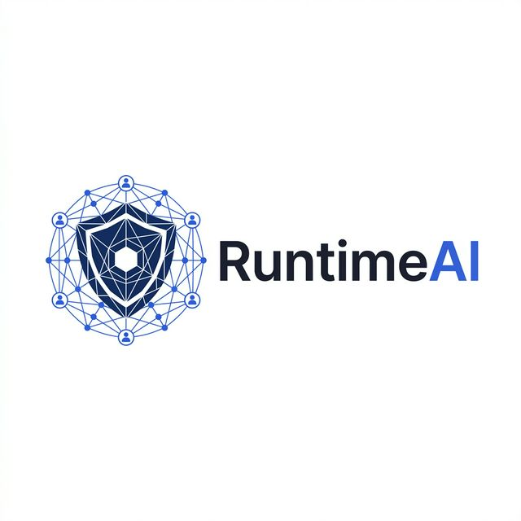

# MUTUAL NON-DISCLOSURE AGREEMENT

---

**NDA Reference**: RTAI-EQIX-NDA-2026-001
**Effective Date**: [Upon execution by both parties]
**Version**: 1.0 — Draft

---

## 1. Parties

This Mutual Non-Disclosure Agreement ("Agreement") is entered into by and between:

| Party | Entity | Address |
|-------|--------|---------|
| **Party A** | RuntimeAI, Inc. ("RuntimeAI") | 2261 Market Street, STE 30493, San Francisco, CA 94114 |
| **Party B** | Equinix, Inc. ("Equinix") | One Lagoon Drive, Redwood City, CA 94065 |

Each a "Party" and collectively the "Parties."

---

## 2. Purpose

The Parties wish to explore a potential business relationship involving the evaluation, integration, and deployment of RuntimeAI's Autonomous AI Security Platform within Equinix infrastructure (the "Purpose"). In connection with the Purpose, each Party may disclose Confidential Information to the other Party.

---

## 3. Definition of Confidential Information

"Confidential Information" means any and all non-public information disclosed by either Party (the "Disclosing Party") to the other Party (the "Receiving Party"), whether orally, in writing, electronically, or by inspection, including but not limited to:

- Software, source code, object code, algorithms, architectures, and system designs
- Product specifications, roadmaps, features, and technical documentation
- Business plans, strategies, pricing, customer lists, and financial information
- Trade secrets, inventions, know-how, and proprietary methodologies
- Security configurations, network architectures, and infrastructure details
- Evaluation results, benchmarks, performance data, and test outcomes
- Any information marked "Confidential," "Proprietary," or with similar designation

Confidential Information does not include information that:
- (a) Is or becomes publicly available through no fault of the Receiving Party;
- (b) Was in the Receiving Party's possession prior to disclosure, without restriction;
- (c) Is independently developed by the Receiving Party without use of Confidential Information;
- (d) Is rightfully received from a third party without restriction on disclosure.

---

## 4. Obligations of the Receiving Party

The Receiving Party agrees to:

1. **Protect** the Disclosing Party's Confidential Information using at least the same degree of care it uses to protect its own confidential information, but in no event less than reasonable care.
2. **Restrict Access** to Confidential Information to only those employees, contractors, and agents who have a need to know for the Purpose and who are bound by confidentiality obligations at least as protective as this Agreement.
3. **Not Disclose** Confidential Information to any third party without the prior written consent of the Disclosing Party.
4. **Not Use** Confidential Information for any purpose other than the Purpose described herein.

---

## 5. Non-Replication

**Neither Party shall replicate, reproduce, reverse-engineer, decompile, or create derivative works based on the other Party's Confidential Information, proprietary technology, trade secrets, or intellectual property** disclosed during the engagement.

Without limiting the foregoing:
- Equinix shall not build, develop, or commission the development of any product, service, or feature that replicates the functionality of RuntimeAI's Platform based on Confidential Information received under this Agreement.
- RuntimeAI shall not build, develop, or commission the development of any product, service, or feature that replicates Equinix's proprietary infrastructure, services, or technology based on Confidential Information received under this Agreement.

This obligation survives termination of this Agreement for a period of **three (3) years**.

---

## 6. Permitted Disclosures

The Receiving Party may disclose Confidential Information if required by:
- Law, regulation, or court order, provided the Receiving Party gives the Disclosing Party prompt written notice (where legally permissible) and cooperates with any efforts to obtain protective treatment.
- Regulatory authorities with jurisdiction over the Receiving Party's business operations.

---

## 7. Intellectual Property

- No license, title, or interest in any intellectual property is granted or implied by this Agreement.
- All Confidential Information remains the property of the Disclosing Party.
- Neither Party acquires any rights to the other Party's patents, copyrights, trademarks, or trade secrets.

---

## 8. Return or Destruction of Information

Upon written request of the Disclosing Party, or upon termination of this Agreement, the Receiving Party shall:

1. Promptly return or destroy all tangible materials containing Confidential Information.
2. Delete all electronic copies of Confidential Information.
3. Certify in writing that all Confidential Information has been returned or destroyed.

The Receiving Party may retain copies solely as required by law or regulatory requirements, provided such copies remain subject to this Agreement.

---

## 9. Term and Termination

- **Term**: This Agreement is effective from the Effective Date and remains in force for **two (2) years**.
- **Termination**: Either Party may terminate this Agreement with **30 days' written notice**.
- **Survival**: The obligations regarding Confidential Information, Non-Replication (Section 5), and Intellectual Property (Section 7) survive termination for a period of **three (3) years** from the date of disclosure.

---

## 10. No Obligation

Nothing in this Agreement obligates either Party to:
- Enter into any further agreement or business relationship.
- Purchase, license, or use any product or service.
- Disclose any particular Confidential Information.

---

## 11. Remedies

Each Party acknowledges that unauthorized disclosure or use of Confidential Information may cause irreparable harm for which monetary damages may be inadequate. The Disclosing Party shall be entitled to seek equitable relief, including injunction and specific performance, in addition to all other available remedies.

---

## 12. General Provisions

### 12.1 Governing Law
This Agreement shall be governed by the laws of the **State of California**, without regard to conflict of law provisions.

### 12.2 Entire Agreement
This Agreement constitutes the entire agreement between the Parties regarding the subject matter hereof and supersedes all prior agreements, understandings, and representations.

### 12.3 Amendments
No amendment to this Agreement shall be effective unless in writing and signed by both Parties.

### 12.4 Assignment
Neither Party may assign this Agreement without the prior written consent of the other Party, except in connection with a merger, acquisition, or sale of substantially all of its assets.

### 12.5 Severability
If any provision of this Agreement is found to be unenforceable, the remaining provisions shall continue in full force and effect.

### 12.6 Counterparts
This Agreement may be executed in counterparts, each of which shall be deemed an original.

---

## 13. Signatures

| | RuntimeAI, Inc. | Equinix, Inc. |
|--|----------------|---------------|
| **Name** | Roshan Shaik | |
| **Title** | Founder & CEO | |
| **Date** | | |
| **Signature** | _________________ | _________________ |

---

*RTAI-EQIX-NDA-2026-001 — Draft v1.0 — March 27, 2026*
